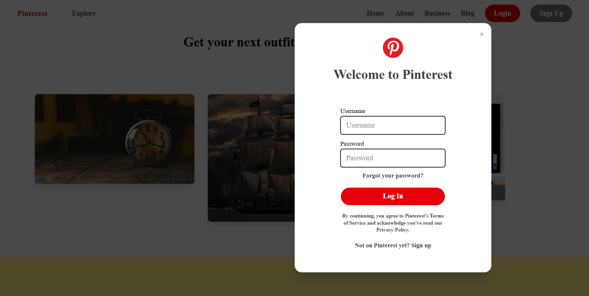
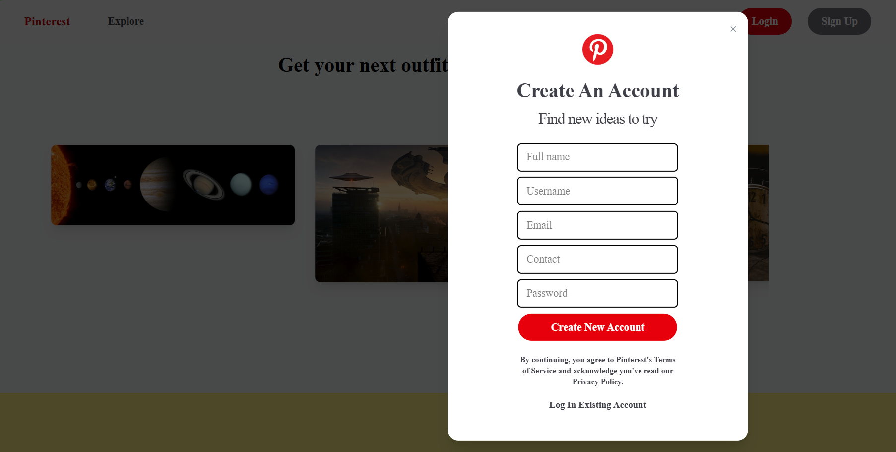
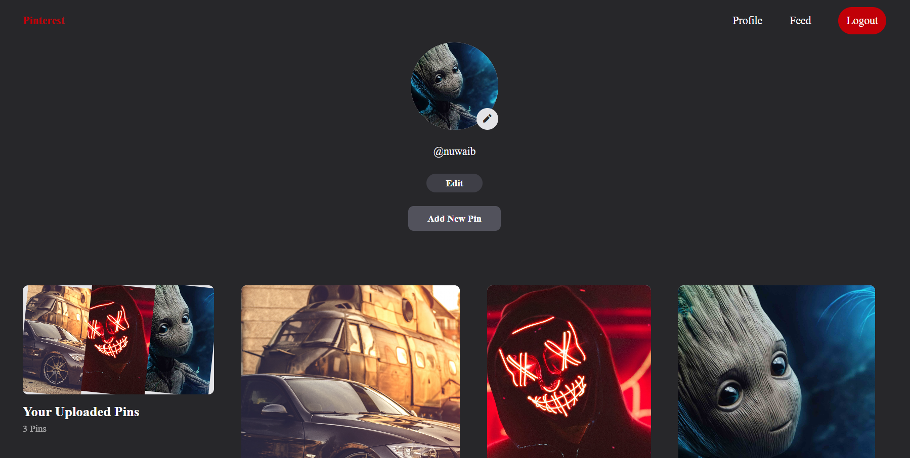

# Pinterest Clone 🖼️ | Node.js + Express.js + MongoDB

<p align="center">
  
</p>


A **full-featured Pinterest-inspired web application** that enables users to **discover, upload, and share images** seamlessly. Built using **Node.js, Express.js, and MongoDB**, this project replicates the core functionalities of Pinterest, including **user authentication, dynamic user feeds, and profile management**.

---

## 🚀 Features Implemented

✅ **User Authentication & Sessions** – Secure login/signup with `passport-local` & `passport-local-mongoose`  
✅ **Dynamic User Feed** – Showcases posts from all logged-in users  
✅ **User Profile Management** – Personalized profiles displaying user-uploaded images  
✅ **Image Uploading System** – Uses `multer` & `uuid` for secure and efficient file handling  
✅ **Responsive Grid Layout** – A real Pinterest-like layout built with `EJS` and `Tailwind CSS`  
✅ **Session Persistence** – Maintains user authentication using `express-session`  

---

## 📌 Upcoming Features (🚧 Work in Progress)

⚡ **Boards Feature** – Users can create, organize, and manage collections of images  
👍 **Like & Save Functionality** – Users can like and save posts for easy access  
📌 **Advanced Search & Filters** – Improved content discovery options  

---

## 🛠️ Tech Stack & Dependencies

- **Backend:** Node.js, Express.js, MongoDB, Mongoose  
- **Authentication:** Passport.js, passport-local, passport-local-mongoose, express-session  
- **File Uploads:** Multer, UUID  
- **Templating Engine:** EJS  
- **Logging & Debugging:** Morgan, Cookie-parser, Debug  

---

## 🎯 Installation & Setup

Clone the repository and install dependencies:
```bash
$ git clone https://github.com/tajamulali/Pinterest.git
$ cd IDS
$ npm install
```

### 🌍 Setup Environment Variables
Create a `.env` file in the root directory and add the following:
```env
MONGO_URI=your_mongodb_connection_string
SESSION_SECRET=your_secret_key
```

### ▶️ Running the App
Start the development server:
```bash
$ npm start
```

The app runs on `http://localhost:3000`

---

## 🖼️ Screenshots

### 📍 UI|Front Page


### 🔐 Login Page


### 🔐 signUp Page


### 🔐 User Profile



---

## 🤝 Contribution
We welcome contributions! If you’d like to improve the project, feel free to **fork the repo**, create a branch, and submit a pull request.

1. Fork the repo
2. Create your feature branch (`git checkout -b feature-name`)
3. Commit your changes (`git commit -m 'Added a new feature'`)
4. Push to the branch (`git push origin feature-name`)
5. Open a pull request

---

## 📜 License
This project is open-source and available under the **MIT License**.

---

### 📬 Contact & Socials
👤 **Tajamul Ali**  
🔗 [GitHub](https://github.com/tajamulali) | [LinkedIn](https://linkedin.com/in/tajamulali)  

---

### ⭐ Show Some Love
If you found this project useful, don’t forget to **star the repository** ⭐ and share it with your friends! 🚀

